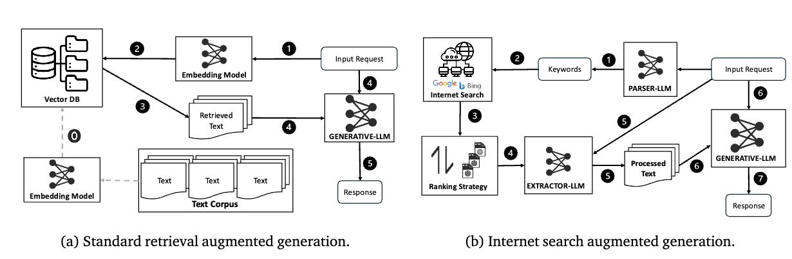

# Zero-Indexing Internet Search Augmented Generation for Large Language Models

**Motivation:** 这篇文章的核心问题是解决现有的基于检索增强生成（RAG，Retrieval-Augmented Generation）方法的局限性，特别是在生成需要实时更新的信息内容时。传统的RAG方法依赖于静态的、预处理过的语料库和索引机制，而无法动态地融入最新的互联网信息。
文章提出了一种通过搜索引擎API动态集成最新在线信息的生成范式，这种方法不需要维护固定语料库的索引，解决了传统RAG方法在信息时效性和内容多样性上的不足。

  
